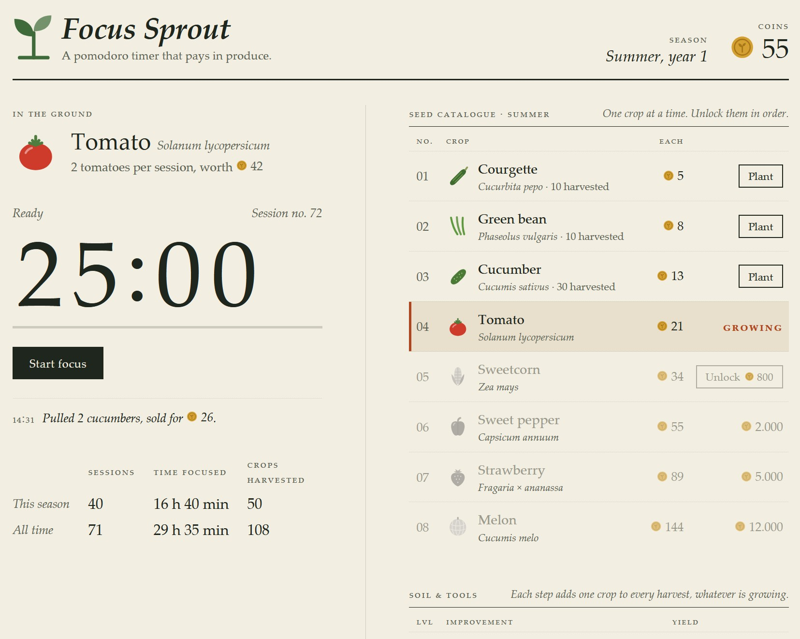
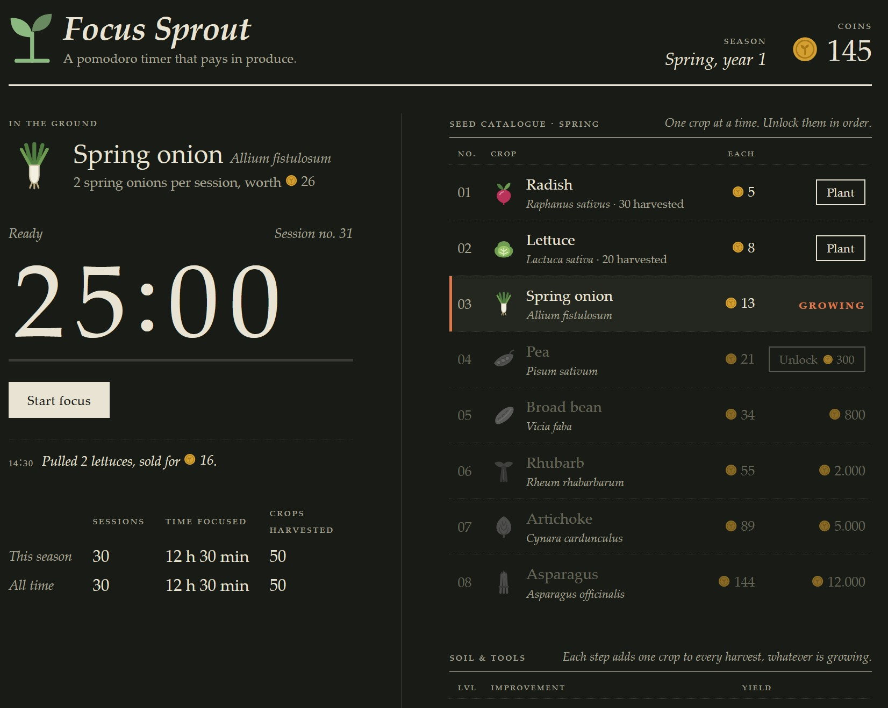
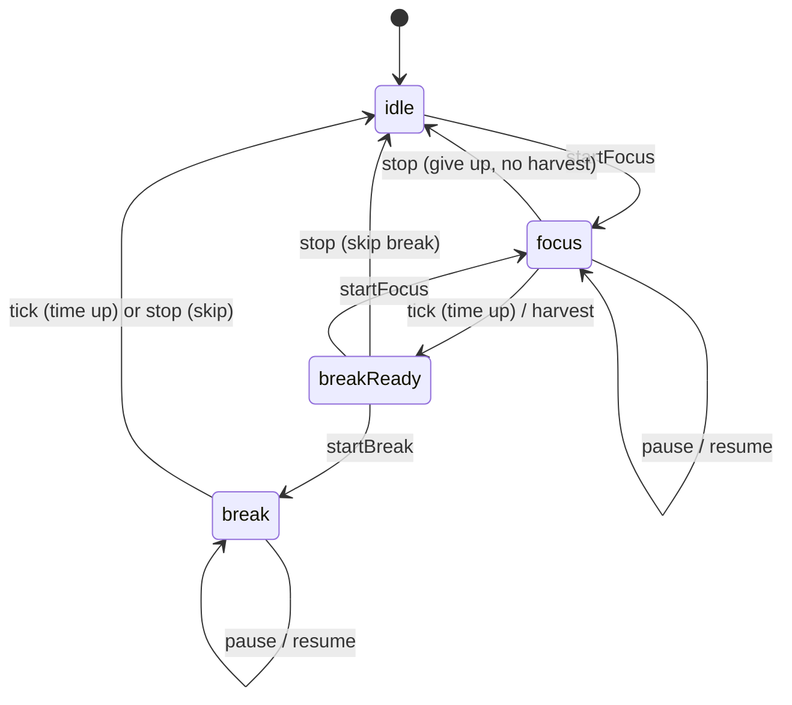

# Focus Sprout

A pomodoro timer with a small economy attached. Every focus session you finish
harvests the crop you have planted. You sell the harvest for coins, and you
spend coins on better crops and better soil.

There is no garden to decorate and no cosmetics. You get one bed with one crop
in it, a timer, and two price lists.

<p align="center">
  
  
</p>

URL: https://PaskoZhelev.github.io/focus-sprout/

## The game

### The loop

1. **Plant a crop.** You start with radishes, which are free.
2. **Focus.** Run a pomodoro (25 minutes by default).
3. **Harvest.** When the countdown ends, the crop is pulled and sold on the
   spot. Coins = crops per session × the crop's value.
4. **Break.** The timer stops on a "Session complete" screen and waits for you
   to start the break (or skip it). Every 4th session gets a long break.
5. **Spend, or don't.** The crop stays planted after the session, so you can
   run the next one straight away. You only change anything when you choose to
   and can pay for it.

### Crops

Crops unlock **in order**. The next one in the catalogue is the only one you can
buy. When you unlock a crop it gets planted straight away. You can switch back
to any crop you already own in the current season at no cost.

Every season has its own eight crops, but they all sit on the same price ladder:

| No. | Unlock price | Value per crop | Spring       | Summer       | Autumn   | Winter          |
| --: | -----------: | -------------: | ------------ | ------------ | -------- | --------------- |
|  01 |         free |              5 | Radish       | Courgette    | Beetroot | Kale            |
|  02 |           30 |              8 | Lettuce      | Green bean   | Carrot   | Leek            |
|  03 |          150 |             13 | Spring onion | Cucumber     | Potato   | Parsnip         |
|  04 |          400 |             21 | Pea          | Tomato       | Apple    | Brussels sprout |
|  05 |        1,000 |             34 | Broad bean   | Sweetcorn    | Pear     | Red cabbage     |
|  06 |        2,200 |             55 | Rhubarb      | Sweet pepper | Pumpkin  | Celeriac        |
|  07 |        5,000 |             89 | Artichoke    | Strawberry   | Grape    | Chicory         |
|  08 |        9,000 |            144 | Asparagus    | Melon        | Saffron  | Black truffle   |

### Soil & tools (yield upgrades)

One upgrade track sets how many crops a single session produces. It applies to
whatever is planted.

| Level | Improvement     | Crops per session | Cost |
| ----: | --------------- | ----------------: | ---: |
|     1 | Bare soil       |                 1 |    — |
|     2 | Watering can    |                 2 |   10 |
|     3 | Compost heap    |                 3 |   30 |
|     4 | Raised beds     |                 5 |   70 |
|     5 | Drip irrigation |                 7 |  150 |
|     6 | Cold frame      |                10 |  300 |
|     7 | Polytunnel      |                13 |  600 |
|     8 | Greenhouse      |                16 |  800 |

Tools are cheap next to crops, and every one of them shortens the season. A
simple rule that comes within one session of the fastest route: buy whichever is
cheaper, the next tool or the next crop.

Played that way you get something new every 2 to 6 sessions and own everything
in a season after about 49 sessions, which is roughly 20 hours of focused work.

### Seasons

The game has no end. As soon as you harvest the season's last crop (No. 08) for
the first time, a panel offers to start the next season. You don't need every
tool for this. Moving on is optional: you can keep harvesting, and buying tools,
for as long as you like first.

Starting a new season puts you back on a bare plot. Coins, unlocked crops and
the yield level reset, and the new season's first crop is planted. Prices stay
the same, so every season plays at the same pace. Per-crop harvest counts are
never reset. Crops from earlier seasons can't be planted.

The panel under the timer tracks sessions, focus time and crops harvested twice: for the
current season (reset when a new season starts) and for all time.

Seasons run Spring → Summer → Autumn → Winter, then a new year begins with
Spring again. The header shows the current season and year. There are no
bonuses for later years.

### Rules that keep it honest

- **Nothing pays out until the countdown ends.** Giving up on a session earns
  nothing. If the countdown had already run out by the time you confirmed,
  though, the session counts and you get paid.
- **The bed is locked during focus.** You can't plant or unlock crops, buy soil
  and tools, or start a new season while a session is running. The harvest always matches the
  crop and yield you had when you pressed start.
- **Timer lengths are typed in**, under "Timer lengths" in the footer. Any
  whole number above zero is accepted when you leave the field or press Enter.
  Fractions are rounded, and anything else (empty, zero, negative) reverts to
  the previous value. There is no upper limit. Defaults are 25 / 5 / 15 /
  every 4, and "Reset to defaults" appears once you change any of them.
- **Closing the tab doesn't cost you anything.** The timer stores an end
  timestamp, not a running counter. If a session ended while the page was
  closed, you get paid for it the next time you open the page.

## Architecture

```
src/
├── game/                  Pure domain logic. No React, no DOM.
│   ├── catalog.ts         Seasons, crops, price ladder and upgrades. CropId comes from it.
│   ├── types.ts           State, timer and action types (discriminated unions).
│   ├── rules.ts           Derived values: yield, next unlock, remaining time…
│   ├── reducer.ts         gameReducer + settle(): every state transition.
│   ├── persistence.ts     Versioned localStorage save and schema validation.
│   └── *.test.ts          Vitest unit tests for the reducer and persistence.
├── state/
│   ├── gameContext.ts     State and dispatch contexts, useGameState/useGameDispatch.
│   └── GameProvider.tsx   useReducer, loads on start, saves on change.
├── hooks/
│   ├── usePomodoro.ts     View model for the timer (remaining time, actions).
│   ├── useNow.ts          Ticking clock that catches up when the tab is visible again.
│   ├── useTimerAlerts.ts  Chime, plus a system notification if the page isn't focused.
│   ├── useUnseen.ts       True while the latest event happened after you last looked.
│   ├── useFavicon.ts      Swaps in public/favicon-alert.svg while something is waiting.
│   ├── useTheme.ts        Auto / light / dark preference, applied as <html data-theme>.
│   └── useDocumentTitle.ts
├── lib/                   Framework-free helpers (formatting, chime, notifications, sound store, debug flag).
└── components/            Presentational components, each with a CSS Module.
    └── icons/             Hand-drawn inline SVG crop and coin icons.
```

### State model

All game state lives in one `GameState` object, managed by `useReducer`:

```ts
interface GameState {
  garden: GardenState          // coins, seasonsPassed, unlockedCount, planted, yieldLevel, finalCropHarvested, harvested
  timer: TimerState            // idle | focus | breakReady | break
  settings: Settings           // focus / break lengths
  stats: Stats                 // { season, total }: sessions, focused time, crops
  lastEvent: TimerEvent | null // latest harvest or break-over, drives notice and chime
}
```

`TimerState` and `Countdown` are discriminated unions, so impossible states
can't be expressed. For example, a paused timer has `remainingMs` but no
`endsAt`, and an idle timer has neither.

### Time is an input, not a side effect

The reducer never calls `Date.now()`. Every time-dependent action (`startFocus`,
`pause`, `resume`, `stop`, `tick`) carries `now`. This keeps the reducer pure and
deterministic, and the tests can jump ahead by hours without fake timers.

`settle(state, now)` completes the countdown if it has run out by `now`. A
focus session that ends pays out and stops in `breakReady`. The break only
starts when you press Start break, so it never runs down while you're away.
Completing a countdown moves the
state to the next phase, so calling `tick` again with the same `now` changes
nothing. That makes payouts idempotent. A double-invoked effect under React
StrictMode can't pay out twice.



### Rendering the clock

`usePomodoro` works out the remaining time from `endsAt − now`, using `useNow`.
`useNow` re-renders every 250 ms, but only while a countdown is running. When
the remaining time reaches zero, the hook dispatches `tick`. `useNow` also
listens for `visibilitychange`, so a throttled background tab catches up right
away when you come back. Separately, `usePomodoro` sets one `setTimeout` for
`endsAt`. Browsers throttle repeating timers in background tabs, but not a
single timeout like this, so the session still ends (and alerts) on time.
Delays longer than `setTimeout` allows (about 24.8 days) are waited out in
steps. From one hour up the clock reads `h:mm:ss` and shrinks to keep the width
of `mm:ss`.

### Session-end alerts

- **Notification.** The first Start asks for notification permission. When a
  session or break ends while the page isn't focused, a system notification
  appears. Clicking it brings the tab forward.
- **Tab.** The title reads "✓ Session done" (or "Break's over"), and the favicon
  gets an accent dot until you come back to the page.

### Persistence

State is saved to `localStorage` under a versioned envelope
(`{ version, state }`). On load, `reviveState` treats the stored JSON as
untrusted. It checks every field and drops unknown crop IDs. It repairs a
malformed timer, and it falls back to a new game if the garden is impossible
(negative coins, a planted crop that isn't unlocked, and so on). The state is
settled once while loading, so time spent away is accounted for.

`finalCropHarvested` records whether this season's last crop has been
harvested. It resets with each new season. The lifetime harvest counts can't be
used for this, because in year two you've already harvested that crop in year one.

`seasonsPassed` is a single counter. The season (`seasonsPassed % 4`) and year
(`floor(seasonsPassed / 4) + 1`) are both derived from it, so they can't get
out of step.

### Conventions

- TypeScript `strict` plus `noUncheckedIndexedAccess`. Data tables use
  `as const satisfies`, so IDs are literal types and definitions stay checked.
- The reducer rejects invalid actions by returning the same state. The UI
  disables those buttons too, but the rules live in one place.
- State and dispatch use separate contexts, so components that only dispatch
  don't re-render on state changes.
- Styling uses CSS Modules per component and a small set of global design tokens
  in `index.css`. Dark tokens apply under `html[data-theme='dark']`.
- Theme: the footer switch offers Auto, Light and Dark. Auto (the default)
  follows `prefers-color-scheme` and updates live. A choice of Light or Dark is
  saved under `focus-sprout:theme`. An inline script in `index.html` sets
  `data-theme` before first paint, so the page doesn't flash.
- Sound: the footer's On/Off switch controls the chime. Turning it on plays the
  chime once as a preview. "Off" is saved under `focus-sprout:sound`.
  `lib/sound.ts` is a tiny store read through `useSyncExternalStore`, so the
  switch and the chime share one value without a context. Browsers only let
  audio start from a user gesture, so Start and Resume call `primeAudio()` to
  wake the `AudioContext` early. A chime that still can't play within a second
  is dropped rather than played late.
- Icons are inline SVG components rather than image files or emoji. Nothing
  extra is downloaded, and they look the same on every platform.
  `Record<CropId, …>` makes the compiler insist on a drawing for every crop.
- Accessibility: semantic tables for the price lists, `role="timer"` and a
  `progressbar` for the countdown, and an `aria-live` region for harvest
  notices. Motion is reduced when the user asks for it.

## Development

```bash
npm install
npm run dev        # start the dev server
npm test           # run unit tests once (vitest)
npm run lint       # oxlint
npm run build      # type-check and build to dist/
```

### Debug tools

A dashed **Debug** panel appears under the footer in dev builds only
(`npm run dev`). Production builds don't include it. It is meant for testing
the balance:

- **Finish countdown** ends the current focus session or break right away. A
  focus session pays out as normal.
- **+1 / +10 sessions** credit full sessions of the planted crop at the current
  yield, without running the timer.
- **Own everything** unlocks every crop and tool of the current season for
  free. One more session of the last crop then opens the next season.
- **Reset progress** wipes coins, crops, upgrades, seasons and stats. Timer
  settings are kept.
- A readout shows coins per session and how many sessions away the next crop
  and the next tool are.

These are ordinary reducer actions (`debug/finish`, `debug/harvest`,
`debug/ownAll`, `debug/reset`), so they follow the same rules as real play and have unit tests.

## Deploying to GitHub Pages

`vite.config.ts` uses `base: './'`, so the build works under any repository
sub-path.

1. Push the project to a GitHub repository with a `main` branch.
2. In **Settings → Pages**, set **Source** to **GitHub Actions**.
3. Each push to `main` runs [.github/workflows/deploy.yml](.github/workflows/deploy.yml).
   It lints, tests, builds, checks that the debug panel isn't in the bundle,
   and publishes `dist/`. It can also be started by hand from the **Actions**
   tab (`workflow_dispatch`).
