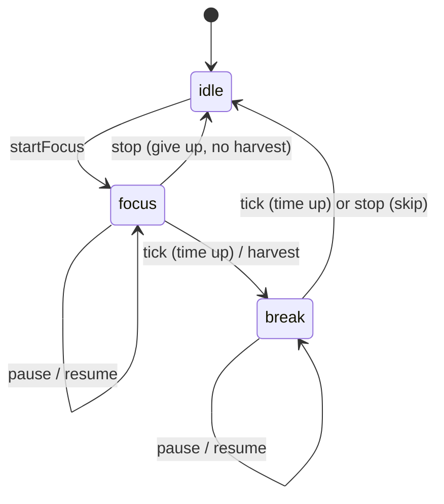

# Focus Sprout

A pomodoro timer with a small economy attached. Every focus session you finish
harvests the crop you have planted. You sell the harvest for coins, and you
spend coins on better crops and better soil.

There is no garden to decorate and no cosmetics. You get one bed with one crop
in it, a timer, and two price lists.

## The game

### The loop

1. **Plant a crop.** You start with radishes, which are free.
2. **Focus.** Run a pomodoro (25 minutes by default).
3. **Harvest.** When the countdown ends, the crop is pulled and sold on the
   spot. Coins = crops per session × the crop's value.
4. **Break.** A short break starts automatically. Every 4th session gets a long
   break.
5. **Spend, or don't.** The crop stays planted after the session, so you can
   run the next one straight away. You only change anything when you choose to
   and can pay for it.

### Crops

Crops unlock **in order**. The next one in the catalogue is the only one you can
buy. When you unlock a crop it gets planted straight away. You can switch back
to any crop you already own at no cost.

| No. | Crop       | Unlock price | Value per crop |
| --: | ---------- | -----------: | -------------: |
|  01 | Radish     |         free |              5 |
|  02 | Carrot     |           25 |              8 |
|  03 | Potato     |          100 |             13 |
|  04 | Tomato     |          300 |             21 |
|  05 | Sweetcorn  |          800 |             34 |
|  06 | Pumpkin    |        2,000 |             55 |
|  07 | Strawberry |        5,000 |             89 |
|  08 | Saffron    |       12,000 |            144 |

### Soil & tools (yield upgrades)

One upgrade track sets how many crops a single session produces. It applies to
whatever is planted.

| Level | Improvement     | Crops per session |   Cost |
| ----: | --------------- | ----------------: | -----: |
|     1 | Bare soil       |                 1 |      — |
|     2 | Watering can    |                 2 |     40 |
|     3 | Compost heap    |                 3 |    150 |
|     4 | Raised beds     |                 4 |    450 |
|     5 | Drip irrigation |                 5 |  1,200 |
|     6 | Cold frame      |                 6 |  3,000 |
|     7 | Polytunnel      |                 7 |  7,000 |
|     8 | Greenhouse      |                 8 | 15,000 |

A player who always buys the best-value upgrade gets something new every 5 to
20 sessions. They own everything after about 140 sessions, which is roughly 58
hours of focused work.

### Rules that keep it honest

- **Nothing pays out until the countdown ends.** Giving up on a session earns
  nothing. If the countdown had already run out by the time you confirmed,
  though, the session counts and you get paid.
- **The bed is locked during focus.** You can't plant or unlock crops, or buy
  soil and tools, while a session is running. The harvest always matches the
  crop and yield you had when you pressed start.
- **The minimum focus length is 10 minutes.**
- **Closing the tab doesn't cost you anything.** The timer stores an end
  timestamp, not a running counter. If a session ended while the page was
  closed, you get paid for it the next time you open the page.

## Architecture

```
src/
├── game/                  Pure domain logic. No React, no DOM.
│   ├── catalog.ts         Crop and upgrade data. CropId type comes from it.
│   ├── types.ts           State, timer and action types (discriminated unions).
│   ├── rules.ts           Derived values: yield, next unlock, remaining time…
│   ├── reducer.ts         gameReducer + settle(): every state transition.
│   ├── persistence.ts     Versioned localStorage save and schema validation.
│   └── *.test.ts          Vitest unit tests for the reducer and persistence.
├── state/
│   ├── gameContext.ts     State and dispatch contexts, useGameState/useGameDispatch.
│   └── GameProvider.tsx   useReducer, loads on start, saves on change.
├── hooks/
│   ├── usePomodoro.ts     View model for the timer (remaining time, actions).
│   ├── useNow.ts          Ticking clock that catches up when the tab is visible again.
│   ├── useChime.ts        Plays a sound when the timer produces a new event.
│   ├── useTheme.ts        Auto / light / dark preference, applied as <html data-theme>.
│   └── useDocumentTitle.ts
├── lib/                   Framework-free helpers (formatting, chime, sound store, debug flag).
└── components/            Presentational components, each with a CSS Module.
    └── icons/             Hand-drawn inline SVG crop and coin icons.
```

### State model

All game state lives in one `GameState` object, managed by `useReducer`:

```ts
interface GameState {
  garden: GardenState          // coins, unlockedCount, planted, yieldLevel, harvested
  timer: TimerState            // idle | focus | break, each with a Countdown
  settings: Settings           // focus / break lengths
  stats: Stats                 // sessions, focused time
  lastEvent: TimerEvent | null // latest harvest or break-over, drives notice and chime
}
```

`TimerState` and `Countdown` are discriminated unions, so impossible states
can't be expressed. For example, a paused timer has `remainingMs` but no
`endsAt`, and an idle timer has neither.

### Time is an input, not a side effect

The reducer never calls `Date.now()`. Every time-dependent action (`startFocus`,
`pause`, `resume`, `stop`, `tick`) carries `now`. This keeps the reducer pure and
deterministic, and the tests can jump ahead by hours without fake timers.

`settle(state, now)` completes every countdown that has run out by `now`. A
focus session that ends rolls into its break, and that break can also be over
already if the tab was closed long enough. Completing a countdown moves the
state to the next phase, so calling `tick` again with the same `now` changes
nothing. That makes payouts idempotent. A double-invoked effect under React
StrictMode can't pay out twice.



### Rendering the clock

`usePomodoro` works out the remaining time from `endsAt − now`, using `useNow`.
`useNow` re-renders every 250 ms, but only while a countdown is running. When
the remaining time reaches zero, the hook dispatches `tick`. `useNow` also
listens for `visibilitychange`, so a throttled background tab catches up right
away when you come back.

### Persistence

State is saved to `localStorage` under a versioned envelope
(`{ version, state }`). On load, `reviveState` treats the stored JSON as
untrusted. It checks every field and drops unknown crop IDs. It repairs a
malformed timer, and it falls back to a new game if the garden is impossible
(negative coins, a planted crop that isn't unlocked, and so on). The state is
settled once while loading, so time spent away is accounted for.

### Conventions

- TypeScript `strict` plus `noUncheckedIndexedAccess`. Data tables use
  `as const satisfies`, so IDs are literal types and definitions stay checked.
- The reducer rejects invalid actions by returning the same state. The UI
  disables those buttons too, but the rules live in one place.
- State and dispatch use separate contexts, so components that only dispatch
  don't re-render on state changes.
- Styling uses CSS Modules per component and a small set of global design tokens
  in `index.css`. Dark tokens apply under `html[data-theme='dark']`.
- Theme: the footer switch offers Auto, Light and Dark. Auto (the default)
  follows `prefers-color-scheme` and updates live. A choice of Light or Dark is
  saved under `focus-sprout:theme`. An inline script in `index.html` sets
  `data-theme` before first paint, so the page doesn't flash.
- Sound: the footer's On/Off switch controls the chime. Turning it on plays the
  chime once as a preview. "Off" is saved under `focus-sprout:sound`.
  `lib/sound.ts` is a tiny store read through `useSyncExternalStore`, so the
  switch and the chime share one value without a context. Browsers only let
  audio start from a user gesture, so Start and Resume call `primeAudio()` to
  wake the `AudioContext` early. A chime that still can't play within a second
  is dropped rather than played late.
- Icons are inline SVG components rather than image files or emoji. Nothing
  extra is downloaded, and they look the same on every platform.
  `Record<CropId, …>` makes the compiler insist on a drawing for every crop.
- Accessibility: semantic tables for the price lists, `role="timer"` and a
  `progressbar` for the countdown, and an `aria-live` region for harvest
  notices. Motion is reduced when the user asks for it.

## Development

```bash
npm install
npm run dev        # start the dev server
npm test           # run unit tests once (vitest)
npm run lint       # oxlint
npm run build      # type-check and build to dist/
```

### Debug tools

A dashed **Debug** panel appears under the footer in dev builds only
(`npm run dev`). Production builds don't include it. It is meant for testing
the balance:

- **Finish countdown** ends the current focus session or break right away. A
  focus session pays out as normal.
- **+1 / +10 sessions** credit full sessions of the planted crop at the current
  yield, without running the timer.
- **Reset progress** wipes coins, crops, upgrades and stats. Timer settings are
  kept.
- A readout shows coins per session and how many sessions away the next crop
  and the next tool are.

These are ordinary reducer actions (`debug/finish`, `debug/harvest`,
`debug/reset`), so they follow the same rules as real play and have unit tests.

## Deploying to GitHub Pages

`vite.config.ts` uses `base: './'`, so the build works under any repository
sub-path.

1. Push the project to a GitHub repository with a `main` branch.
2. In **Settings → Pages**, set **Source** to **GitHub Actions**.
3. Each push to `main` runs [.github/workflows/deploy.yml](.github/workflows/deploy.yml).
   It lints, tests, builds and publishes `dist/`.
